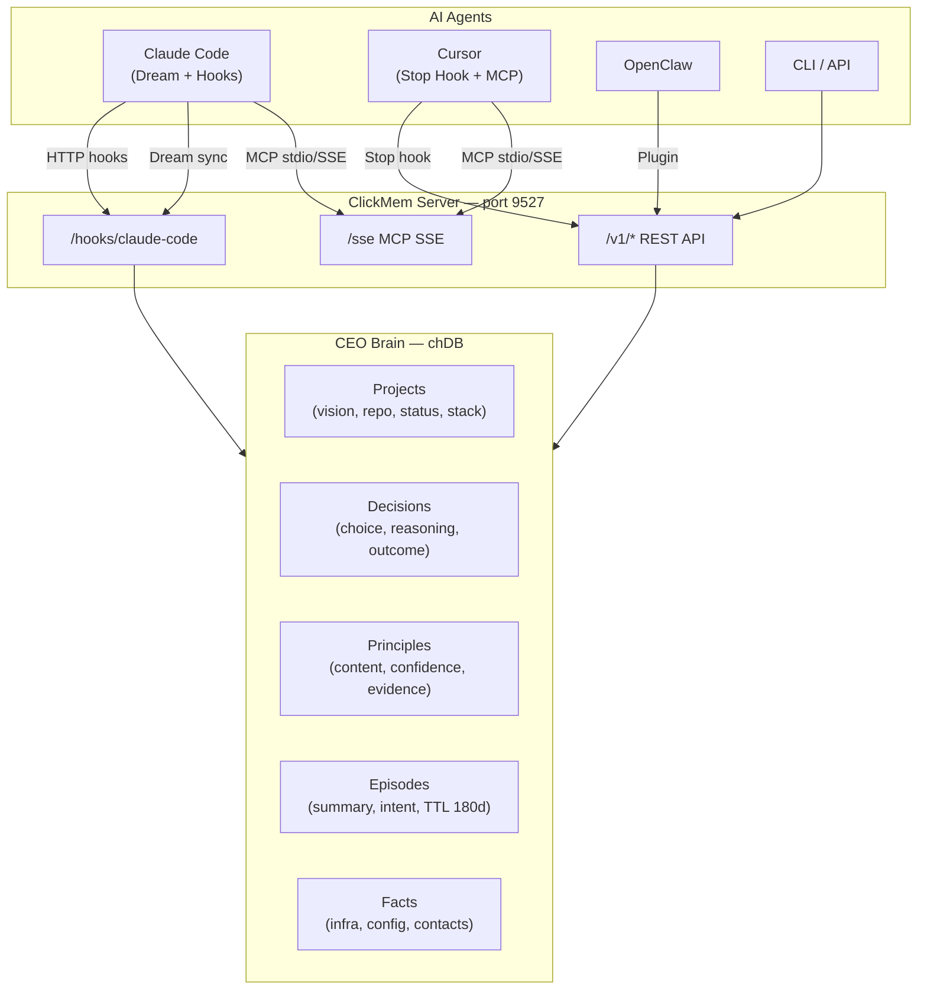

# ClickMem


**Local-first persistent memory for AI coding agents. Works with Claude Code, Cursor, and OpenClaw.**

AI coding agents forget everything between sessions. ClickMem captures the knowledge you build with them — decisions with reasoning, reusable principles, project context — and brings it back when you start a new session. Your agents inherit your thinking patterns, not just raw facts.

## Why ClickMem

- **One brain, all your agents.** Claude Code, Cursor, and OpenClaw share a single knowledge base. Switch tools without losing context.
- **CEO-level extraction.** Not a transcript dump — ClickMem extracts *decisions*, *principles*, and *episodes* from your conversations via a local LLM.
- **Native integrations.** Hooks into Claude Code Dream (auto-memory), Cursor's agents-memory-updater, and MCP for real-time sync.
- **Runs locally.** Everything stays on your machine. Embedding model (Qwen3-Embedding), LLM (Qwen3.5), and database (chDB) — all local, all private.
- **LAN-shareable.** Run the server on one machine, access from any device on your network.

## Quick Start

```bash
pip install clickmem
memory service install        # start background server (port 9527)
memory hooks install          # install hooks for Claude Code & Cursor
memory import                 # import existing conversation history
```

That's it. Every session now auto-recalls relevant context on start and captures knowledge on completion.

## Agent Integrations

### Claude Code — Dream & Hooks

ClickMem deeply integrates with Claude Code through two mechanisms:

**1. Dream (Auto-Memory) Sync**

Claude Code's [Dream](https://docs.anthropic.com/en/docs/claude-code/memory) system writes structured memory files to `~/.claude/projects/*/memory/*.md` — user preferences, project facts, feedback. ClickMem monitors these files and syncs them into the CEO Brain in real-time:

- **PostToolUse hook**: When Claude Code writes or edits an auto-memory `.md` file, ClickMem immediately parses the YAML frontmatter and ingests it — `feedback` type becomes a Principle, `project`/`reference` becomes a Fact.
- **Stop hook**: At the end of each turn, ClickMem scans the entire auto-memory directory for any changed files (mtime-based) and syncs them all.
- **Direct parse — no LLM needed.** Auto-memory files have structured frontmatter, so ClickMem parses them deterministically. This means Dream memories are available in ClickMem within seconds.

```
~/.claude/projects/{encoded_cwd}/memory/
├── MEMORY.md              ← index (skipped)
├── feedback_testing.md    ← synced as Principle
├── user_role.md           ← synced as Principle (global)
└── project_deploy.md      ← synced as Fact
```

**2. Session Lifecycle Hooks**

Five HTTP hooks capture the full conversation lifecycle:

| Event | What ClickMem does |
|-------|-------------------|
| **SessionStart** | Injects CEO context (~1700 tokens): active principles, recent decisions, project info |
| **UserPromptSubmit** | Buffers the user's prompt for per-turn extraction |
| **Stop** | Extracts decisions/principles/episodes from the turn via local LLM; syncs Dream files |
| **PostToolUse** | Fast-path sync when Claude Code writes to auto-memory files |
| **SessionEnd** | Runs maintenance (dedup, episode cleanup) |

**3. AGENTS.md & CLAUDE.md Import**

ClickMem parses `AGENTS.md` files directly (no LLM) — "Learned User Preferences" become global Principles, "Learned Workspace Facts" become project-scoped Principles. `CLAUDE.md` files are extracted via LLM during `memory import`.

### Cursor — Stop Hook & Rules Sync

ClickMem integrates with Cursor via a TypeScript stop hook and rule file import:

**1. Conversation Capture (Stop Hook)**

The stop hook (`cursor-hooks/hooks/clickmem-stop.ts`) fires when a Cursor conversation ends:
- Parses the JSONL transcript from Cursor's `agent-transcripts/` directory
- Extracts user/assistant messages (handles `<user_query>` tags)
- Fires a **background** ingest request to ClickMem — never blocks Cursor
- Dedup via `generation_id` + transcript mtime tracking

**2. Rules & .mdc Sync**

During `memory import`, ClickMem discovers and imports:
- Project rules: `.cursor/rules/*.md` and `.cursor/rules/*.mdc`
- Global rules: `~/.cursor/rules/*.md` and `~/.cursor/rules/*.mdc`
- Agent transcripts: `~/.cursor/projects/*/agent-transcripts/`

**3. MCP Integration**

Add ClickMem as an MCP server in your project:

```json
// .cursor/mcp.json
{"mcpServers": {"clickmem": {"command": "clickmem-mcp"}}}
```

This gives Cursor access to CEO tools: `ceo_brief`, `ceo_decide`, `ceo_remember`, `ceo_review`, `ceo_retro`, `ceo_portfolio`.

### OpenClaw

OpenClaw connects via a plugin (`clickmem-plugin/index.js`) that provides:
- `clickmem_search` / `clickmem_store` / `clickmem_forget` tools
- `before_agent_start` hook: auto-recall relevant context
- `agent_end` hook: auto-capture knowledge from the turn

### MCP Tools

All agents can access CEO Brain capabilities via MCP:

| Tool | What it does |
|------|-------------|
| `ceo_brief` | Project briefing: principles, decisions, recent activity, semantic search |
| `ceo_decide` | Decision support: surfaces related decisions and relevant principles |
| `ceo_remember` | Store a decision, principle, or episode |
| `ceo_review` | Validate a plan against existing principles and past decisions |
| `ceo_retro` | Retrospective: review outcomes, suggest new principles |
| `ceo_portfolio` | Cross-project overview |

## Architecture



**One server, all your tools.** A single process on port 9527 serves REST API + MCP SSE. Every agent on the LAN shares the same knowledge base.

## Knowledge Extraction

When a conversation ends, ClickMem runs CEO-perspective extraction via a local LLM:

| Entity | What it captures | Lifecycle |
|--------|-----------------|-----------|
| **Decision** | Choice + reasoning + alternatives + context | Permanent; outcome tracked (validated/invalidated) |
| **Principle** | Reusable rule or preference | Permanent; evidence accumulates via dedup |
| **Episode** | What happened + user intent + key outcomes | TTL 180 days; time-decayed in recall |
| **Fact** | Infrastructure details, configs, contacts | Permanent; never auto-deleted |
| **Project** | Name, repo, status, vision, tech stack | Auto-created from cwd |

For long conversations, the extractor segments text into chunks and processes each one. Built-in dedup prevents duplicates — instead, evidence counts increase for matching principles.

## Search & Recall

`memory recall` performs hybrid search across all entity types:

- **Vector similarity**: 256-dim Qwen3-Embedding with cosine distance
- **Keyword matching**: LLM-extracted keywords + entities (IPs, paths, usernames)
- **Type-specific scoring**: validated decisions boosted; facts get specificity bonus; principles weighted by confidence
- **Project-aware ranking**: same-project results boosted 1.3x, other-project penalized 0.6x
- **MMR diversity**: prevents one entity type from dominating results

## Local LLM

ClickMem auto-selects a local LLM based on available hardware:

| Hardware | Model | Speed |
|----------|-------|-------|
| Apple Silicon 32GB | Qwen3.5-9B-4bit (MLX) | ~15s/extraction |
| Apple Silicon 16GB | Qwen3.5-4B-4bit (MLX) | ~8s/extraction |
| Apple Silicon 8GB | Qwen3.5-2B-4bit (MLX) | ~4s/extraction |
| NVIDIA GPU | Qwen3.5 (transformers) | varies |
| CPU-only | Remote API fallback | depends on provider |

Override with `CLICKMEM_LOCAL_MODEL`.

## CLI Reference

```bash
# Setup
memory service install|start|stop|status|logs
memory hooks install [--agent all]
memory hooks status
memory import [--agent all] [--path /dir] [--remote URL]
memory discover                    # detect installed agents + session counts

# Search & Store
memory recall "query"              # hybrid search
memory remember "fact" --category preference
memory forget "memory ID or query"

# CEO Brain
memory portfolio                   # cross-project overview
memory brief [--project-id X]     # detailed project briefing
memory projects | decisions | principles

# Server
memory serve [--host 0.0.0.0]     # REST + MCP SSE on port 9527
memory mcp                         # MCP stdio for Claude Code / Cursor
```

## Configuration

| Variable | Default | Description |
|----------|---------|-------------|
| `CLICKMEM_SERVER_HOST` | `127.0.0.1` | Server bind address |
| `CLICKMEM_SERVER_PORT` | `9527` | Server port |
| `CLICKMEM_REMOTE` | — | Remote server URL (makes CLI/MCP a client) |
| `CLICKMEM_API_KEY` | — | Bearer token for auth |
| `CLICKMEM_DB_PATH` | `~/.openclaw/memory/chdb-data` | chDB data directory |
| `CLICKMEM_LLM_MODE` | `auto` | `auto` / `local` / `remote` |
| `CLICKMEM_LOCAL_MODEL` | auto-selected | Override local LLM model |
| `CLICKMEM_LLM_MODEL` | — | Remote LLM model (for litellm) |

## Remote / LAN Setup

```bash
# Server machine (e.g., Mac Mini)
git clone https://github.com/auxten/clickmem && cd clickmem && ./setup.sh
# setup.sh: Python + uv + service install + hooks + first import

# Client machines
export CLICKMEM_REMOTE=http://mini.local:9527
memory recall "query"              # queries remote server

# Client MCP (Claude Code / Cursor)
# In ~/.claude.json or .cursor/mcp.json:
{"mcpServers": {"clickmem": {"url": "http://mini.local:9527/sse"}}}
```

## Development

```bash
make test          # full test suite
make test-fast     # skip slow semantic tests
make deploy        # rsync to remote + setup
```

**Requirements:** Python >= 3.10, macOS or Linux (chDB), ~1 GB disk for models + data.

## License

MIT
