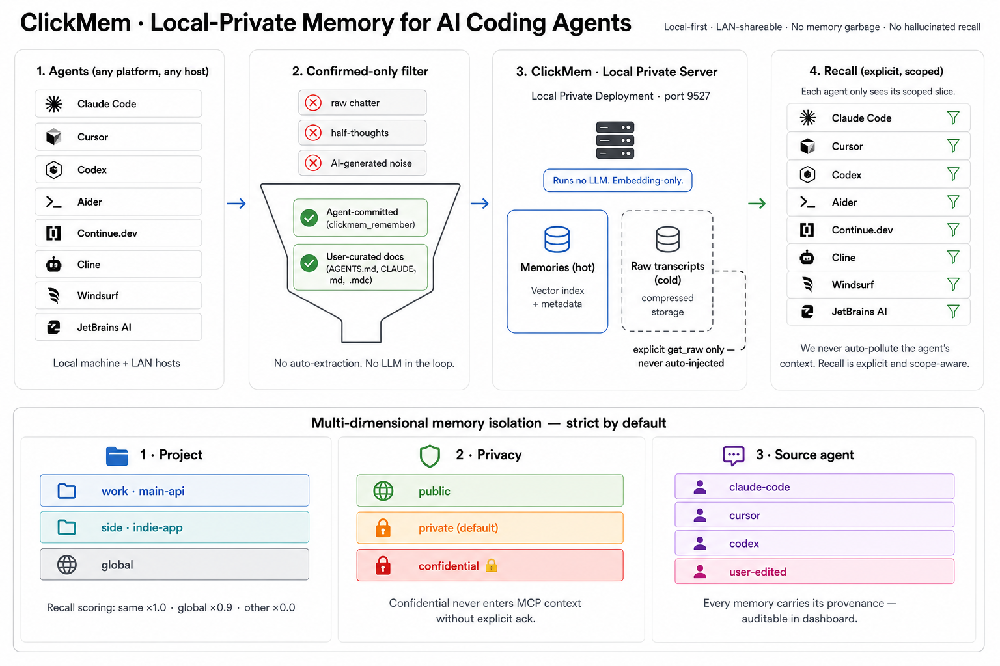

# ClickMem



**A memory safe for the important things humans want AI to remember, revise, and forget.**

ClickMem is for people who use AI as an ongoing working partner: ChatGPT, Claude, Cursor, Claude Code, Codex, internal assistants, scripts, and tools you build yourself. It is not a system that tries to remember everything. It is a small, deliberate store of high-signal facts, decisions, principles, and notes that should survive across sessions without polluting every future prompt.

You have probably seen the opposite:

- You once asked for a vegetarian meal plan while staying with a friend. Months later, ChatGPT tells you how to feed your post-surgery mother "based on your plant-based diet."
- You once asked Claude for a TL;DR. Now it turns a four-page strategy memo into five bullet points, no matter how many times you ask it to expand.
- You once explored Firebase for an MVP. The project moved to Postgres months ago, but your assistant still designs everything around Firestore rules.

That is not memory. That is context pollution with a good memory of the wrong thing.

ClickMem exists for the opposite reason: your AI should remember what matters, forget what stopped being true, and never treat a passing detail as your permanent identity.

## The Problem

Most memory systems are optimized for capture. They watch conversations, infer "facts" about you, and inject those memories later.

That is the failure ClickMem is designed around: **bad memory is worse than no memory**.

## The ClickMem Approach

ClickMem treats memory as a set of beliefs you intentionally keep, not a log of everything that happened.

- **Nothing becomes memory by accident.** A memory enters ClickMem only when you commit it, your agent explicitly commits it, or you import a curated document you already chose to trust.
- **Raw transcripts stay cold.** They can be stored for audit and search, but they are not recalled automatically and are never injected into context as "memory."
- **You can change your mind.** Memories can be revised, forgotten, pinned as authoritative, or blacklisted so a bad pattern never enters the store again.
- **Conflicts are surfaced instead of hidden.** If a new memory is semantically close to an older one but says something different, ClickMem flags the contradiction for resolution.
- **Recall is scoped.** Project, privacy, and source boundaries stop one part of your life or work from leaking into another.

ClickMem is deliberately boring at recall time: retrieve the few relevant committed memories, show why they matched, and let the caller decide what to do with them.

## What You Use It For

ClickMem is useful whenever AI needs continuity without being allowed to invent your history.

- Personal operating principles: how you make decisions, what you avoid, what you have already learned the hard way.
- Project memory: product boundaries, architecture decisions, customer promises, deployment rules, writing style, and "do not do this again" notes.
- Cross-tool continuity: the same memory available to Claude, ChatGPT-like assistants, Cursor, Claude Code, Codex, CLI scripts, or any tool that can call REST or MCP.
- Private team or local workflows: one memory server on your machine or LAN, with optional ClickHouse storage when you need a shared backend.

It is a memory safe, not a memory firehose.

## Quick Start

```bash
pip install clickmem
clickmem service install
clickmem hooks install
clickmem dashboard open
```

That starts a local server, installs supported agent hooks, and opens the dashboard. Hook installation does not import existing memories or agent rule files.

From there, you can add memories manually, let connected agents commit refined memories, import curated docs such as `AGENTS.md` and `CLAUDE.md`, and inspect everything from the dashboard.

At the start of a task, connected agents recall opportunistically: derive the current `project_id`, infer a few task tags, call recall with the user's request, and continue without memory context if recall takes about 5 seconds or fails.

## How Memories Enter

There are two deliberate paths:

1. **Committed by an agent or tool.** A connected agent calls `clickmem_remember` only after it has decided a conclusion is worth keeping.
2. **Imported from curated docs.** You import files such as `AGENTS.md`, `CLAUDE.md`, and `.cursor/rules/*.mdc` that already represent reviewed knowledge.

Everything else is just evidence. Raw chats, hook events, and transcripts may be kept for traceability, but they do not become memory until someone promotes them.

## The Five Operations

ClickMem is built around belief revision:

- **Expand**: add a new memory.
- **Revise**: replace a memory when better information arrives.
- **Contract**: forget a memory without pretending it was never there.
- **Reinforce**: pin a memory as authoritative.
- **Refuse**: blacklist content that should never become memory.

This matters because a useful AI partner must be able to update its beliefs. A system that can only add memories gets noisier and more wrong over time.

## Dashboard

The dashboard is the human control room for the memory safe:

- Browse, search, edit, pin, forget, and blacklist memories.
- Resolve conflicts side by side.
- Inspect recall traces to see why a result matched.
- Promote raw transcript snippets into deliberate memories.
- Check connected agents and hook health.

It is bundled into the package and served by the same local process at `/dashboard`.

## Integrations

ClickMem exposes the same capabilities through the dashboard, CLI, REST API, and MCP tools.

Built-in adapters cover Claude Code, Cursor, Codex CLI, Aider, Continue.dev, Cline, Windsurf, Zed, JetBrains AI, OpenClaw, Hermes Agent, and a generic REST/MCP path for anything else. The design is not limited to coding agents: any AI workflow can use ClickMem as a scoped, user-controlled memory layer.

## Architecture

One local process serves REST, MCP SSE, and the dashboard on the same port. Storage can be embedded chDB for a single machine or LAN setup, or ClickHouse for a shared backend. Recall is embedding-based and filtered by project, tags, privacy, status, and explicit caller options.

Startup recall can filter by tags before vector ranking, so operational memories such as deployment or git workflow notes surface only when the current task asks for that class of context.

The server does not decide what your beliefs are. It stores, retrieves, revises, and audits memories that were explicitly committed.

## Reference

Operational details live in [the reference guide](docs/reference.md):

- CLI commands
- MCP tool parity
- REST endpoints
- configuration
- storage backends
- LAN mode
- import/export
- development commands

## Design Philosophy

ClickMem starts from one assumption:

**The most important operation in memory is not adding something. It is letting you change your mind.**

That is why the core model is not "chat history plus search." It is a small set of beliefs with first-class operations for expansion, revision, contraction, reinforcement, and refusal.

The result is a memory layer that respects both sides of the human-AI relationship: the AI gets continuity, and the human keeps control.

## License

MIT
